# 🛒 Monstadt Market
**Monstadt Market** is an online marketplace that allows users to browse, add items to their cart, and purchase a variety of products with ease. Built using PHP and MySQL for backend operations, this project offers a seamless shopping experience, with front-end interactions managed via HTML, CSS, JavaScript, and AJAX. This project is built for the course UECS2194 WEB APPLICATION DESIGN as part of the assignment task.

## Technologies Used
- **Backend**: PHP (with MySQL)
- **Frontend**: HTML5, CSS3, JavaScript (AJAX)
- **Database**: MySQL

## Requirements
- [Wampserver](https://wampserver.aviatechno.net/)
- Internet access to load in dependencies

## System setup
1. **Environment Setup**:
   - Place the files in the appropriate directory in the wampserver folders under `../wamp64/www/`

2. **Set up the Database**:
   - Run the setup.php file under config folder by entering (http://localhost/monstadt-market/config/setup.php)

3. **Run the application**
   - Run the index.php file under monstadt-market by entering (http://localhost/monstadt-market/)

## Screenshots
.gif playback is available for some images

### Home Page
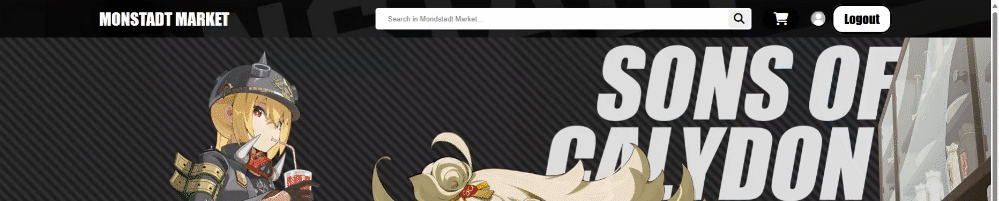

### Sign Up Page
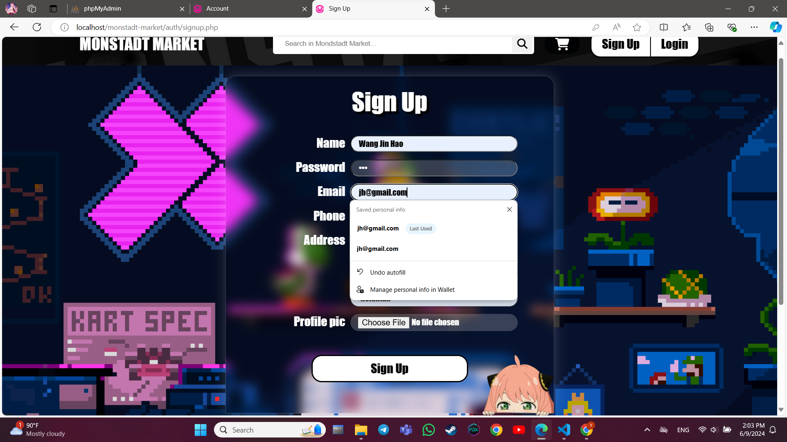

### Login Page
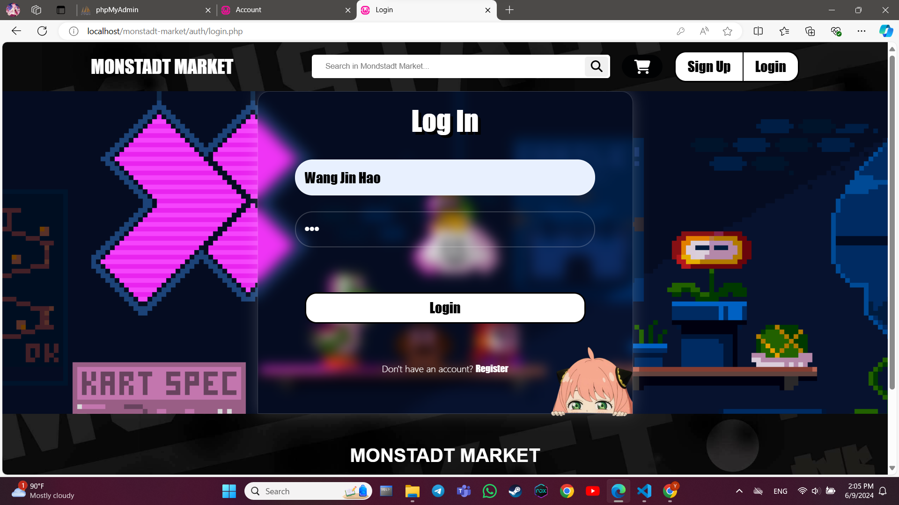

### User Profile Page
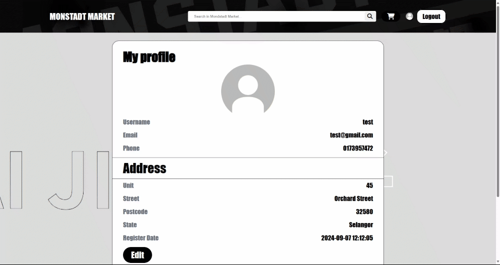
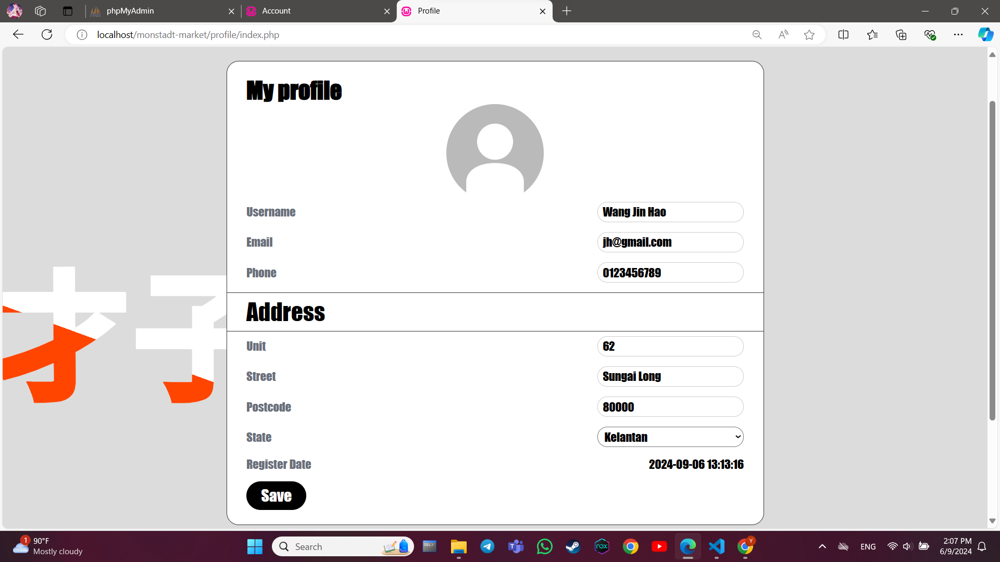

### Search Function
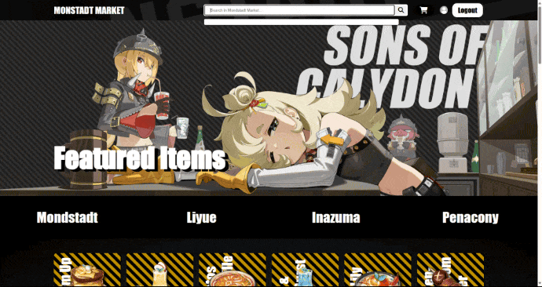

### Product Page
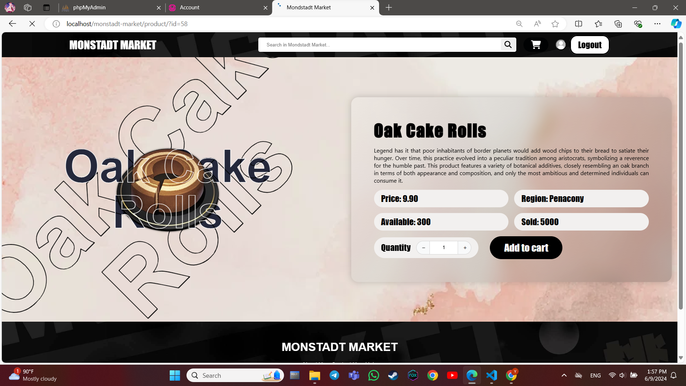
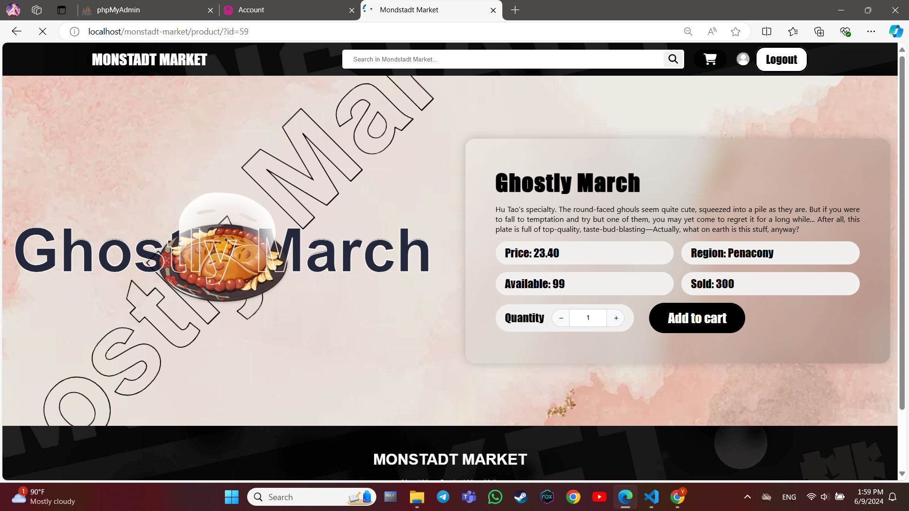

### Cart Page
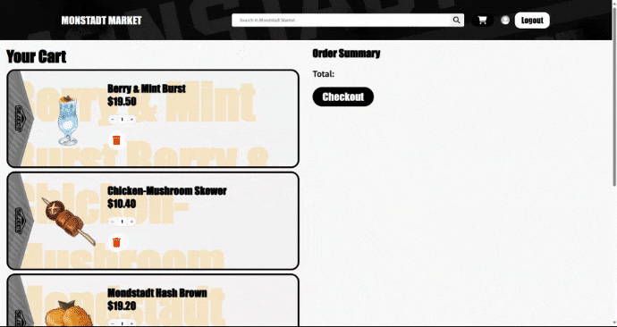

### Checkout Page
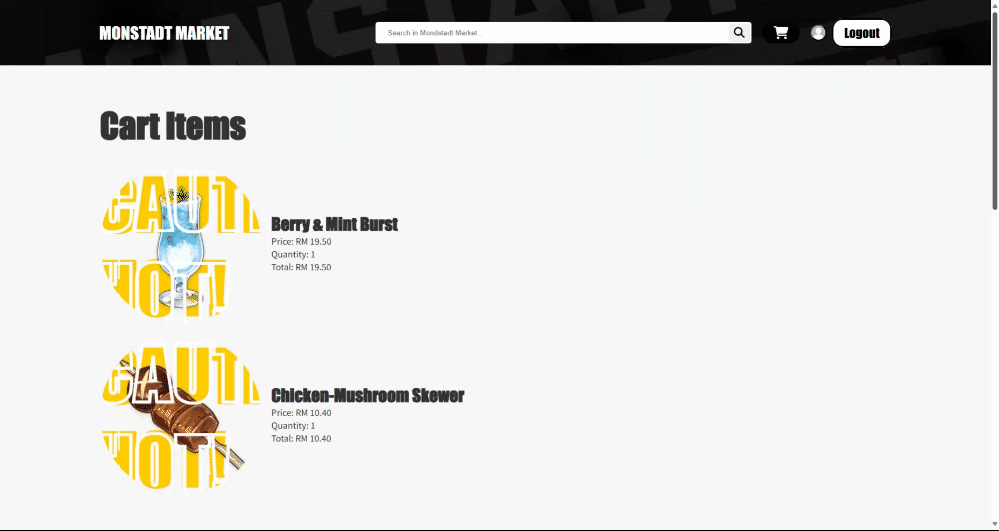
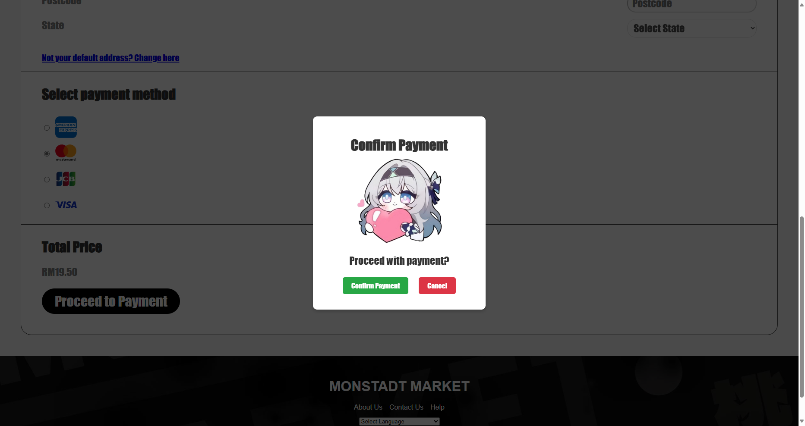

### About Page
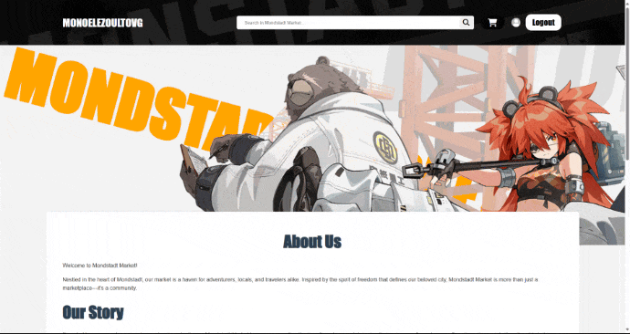

### Contact Us Page
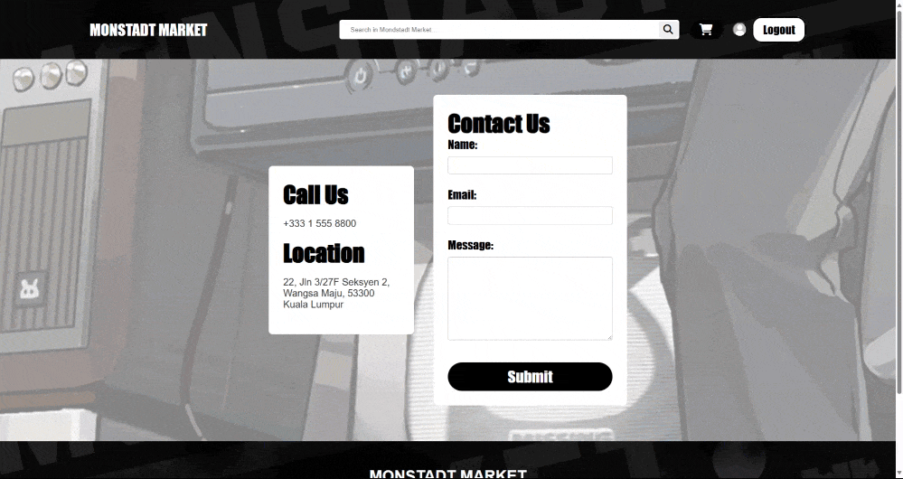

### Help Page
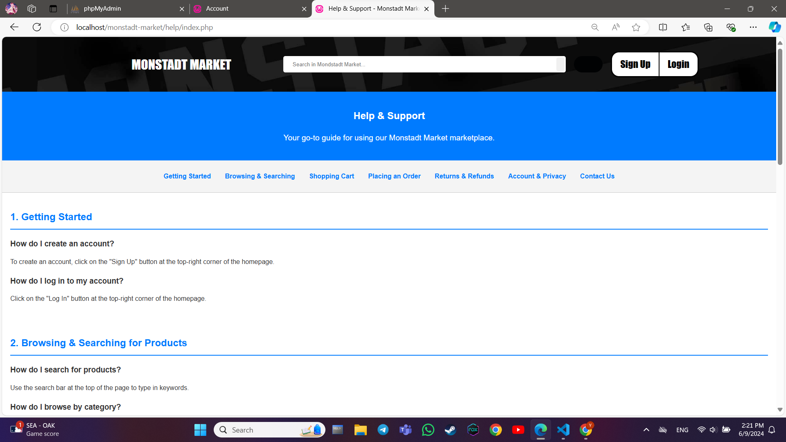

### Footer

## Contributors

