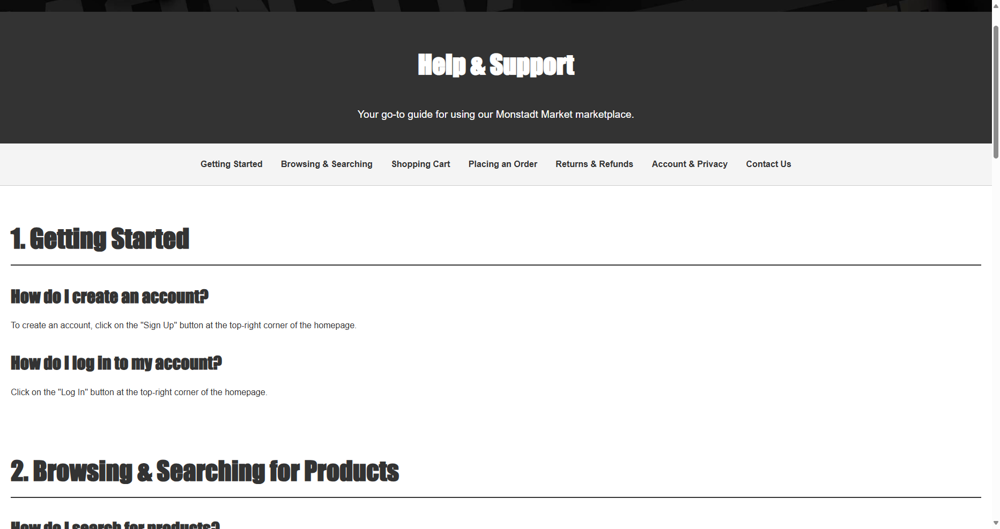

Here's an updated `README.md` file with the name **Monstadt Market**:

---

# 🛒 Monstadt Market

**Monstadt Market** is an online marketplace that allows users to browse, add items to their cart, and purchase a variety of products with ease. Built using PHP and MySQL for backend operations, this project offers a seamless shopping experience, with front-end interactions managed via HTML, CSS, JavaScript, and AJAX.

## Features

- **User Registration and Login**: Secure user authentication with account management features.
- **Product Listings**: Showcase products with detailed descriptions, prices, and images.
- **Shopping Cart**: Dynamically add, update, and remove products from the shopping cart.
- **Checkout System**: Users can review their cart, apply any available discounts, and proceed to checkout.
- **User Profile**: Users can review their user profile and change the user profile information.
- **Help**: Provide necessary guidance to user for using Monstadt Market marketplace.
- **Contact Us**: Provide contact information, including phone number and location, fostering responsiveness to user inquiries and feedback.
- **Search Filter** - Users can search the product and perform product filtering based on region and price range.

## Technologies Used

- **Backend**: PHP (with MySQL)
- **Frontend**: HTML5, CSS3, JavaScript (AJAX)
- **Database**: MySQL

## Requirements
- [Wampserver](https://wampserver.aviatechno.net/)

## System setup

1. **Set up the Database**:
   - Run the setup.php file under config folder by entering (http://localhost/monstadt-market/config/setup.php)

2. **Run the application**
   - Run the index.php file under monstadt-market by entering (http://localhost/monstadt-market/)

## Usage

1. **User Features**:
   - Browse available products on the homepage.
   - Sign up or log in to your account to add items to the cart.
   - View and manage items in the cart, including updating quantities.
   - Proceed to checkout to finalize your purchase.
   - Access the user profile page to view and edit.

## Screenshots

### Home Page

### Sign Up Page

### Login Page

### User Profile Page

### Search Function

### Product Page

### Cart Page

### Checkout Page

### About Page

### Contact Us Page

### Help Page

### Footer

## Future Enhancements

- Product reviews and ratings from users.
- Integration with payment gateways for seamless transactions.
- Personalized recommendations based on user activity.
